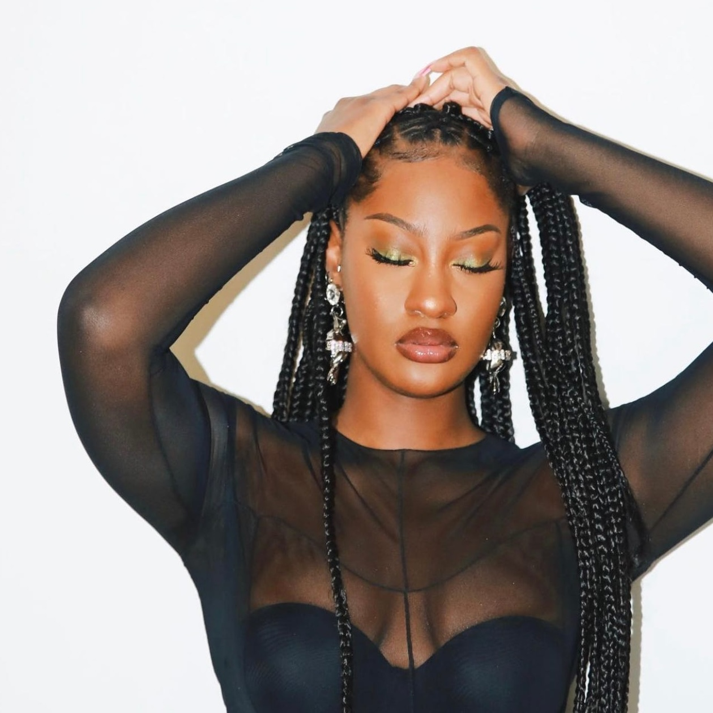

# Voice Synthesis with DiffSVC

This repository contains a Jupyter Notebook showcasing the training of a personalized voice model using Diff-SVC. The model was trained on hours of my freestyle rap recordings, carefully processed and prepared for optimal training.

## Project Overview
Data Collection: I meticulously collected hours of my freestyle rap performances, ensuring a diverse and representative dataset.
Data Processing: The raw audio data was processed using various tools to enhance quality, normalize volume levels, and segment it into suitable training samples.
Model Training: The processed data was fed into the Diff-SVC architecture for training. Diff-SVC's innovative approach to voice modeling allowed for efficient and accurate learning of my unique vocal characteristics.
Creative Application: The trained model is used to recreate famous songs in my own voice, showcasing the potential of Diff-SVC for creative expression and voice synthesis.

## Diff-SVC Architecture Highlights
Diffusion Models: Diff-SVC leverages diffusion models for high-quality audio generation and natural-sounding speech synthesis.
Conditional Generation: The model is conditioned on text input, allowing for precise control over the generated audio's content and style.
Versatility: Diff-SVC can be adapted to various voice cloning and synthesis tasks, making it a powerful tool for creative applications.

## Notebook Contents
Data Preparation: Detailed steps for processing and preparing the training data.
Model Training: Implementation of the Diff-SVC training process, including hyperparameter settings and training progress visualization.
Audio Generation: Examples of using the trained model to generate new audio samples, including recreations of famous songs.
Disclaimer

This project is for educational and creative purposes only. Please respect copyright laws and use the generated audio responsibly.
Enjoy exploring the power of Diff-SVC and the possibilities of personalized voice synthesis!

## AI Covers

* [Tems - Higher](https://on.soundcloud.com/FatUMTk8Y83UgwsWA)
* [Miley Cyrus - Flowers](https://on.soundcloud.com/ZgXzwTq7E7C6fX3E9)

  
  

